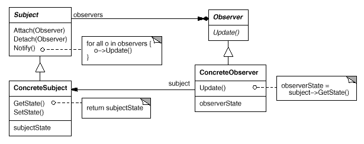

# GeekBand-C150010
---
##KeyValue数据库
###功能
####1. 日志功能接口(ILogger.h)
提供一个ILogger接口，继承这个接口可以将日志保持或输出到不同的介质中，如硬盘，内存，云，输出流等。

**LoggerContext**：可以直接使用，如果需要添加更多参数，可以继承这个类。
####2. 观察者组件接口(Common/Observer.h)
数据库类继承自Subject接口，如果想在数据库数据发生变动时得到通知，则需要实现一个类，这个类必须继承Observer接口以及订阅数据库通知。

**ObserverContext**：可以直接使用，如果需要添加更多参数，可以继承这个类。
####3. GUI
//未完待续
